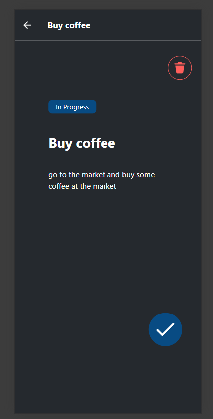
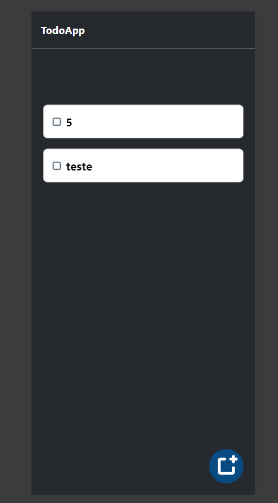

# 📝 To Do App: React Native + Node.js/TypeScript

Welcome to my To Do App mobile application! This project combines the power of React Native for the frontend and Node.js with TypeScript for the backend to deliver a seamless task management experience.

To run the application application go to backend and frontend folders and then read the Readmes

## 📑 Table of Contents

-   Prerequisites
-   Installation
    -   Backend Setup
    -   Frontend Setup
-   Usage

## 📷 Screenshots




## 😀 Usage

After doing all the installation and configs, to run this project you must run:

1. containers up for database:

```bash
    docker-compose up -d
```

2. backend folder:

```bash
    npm run start
```

3. frontend folder:

```bash
    npm run start
```
