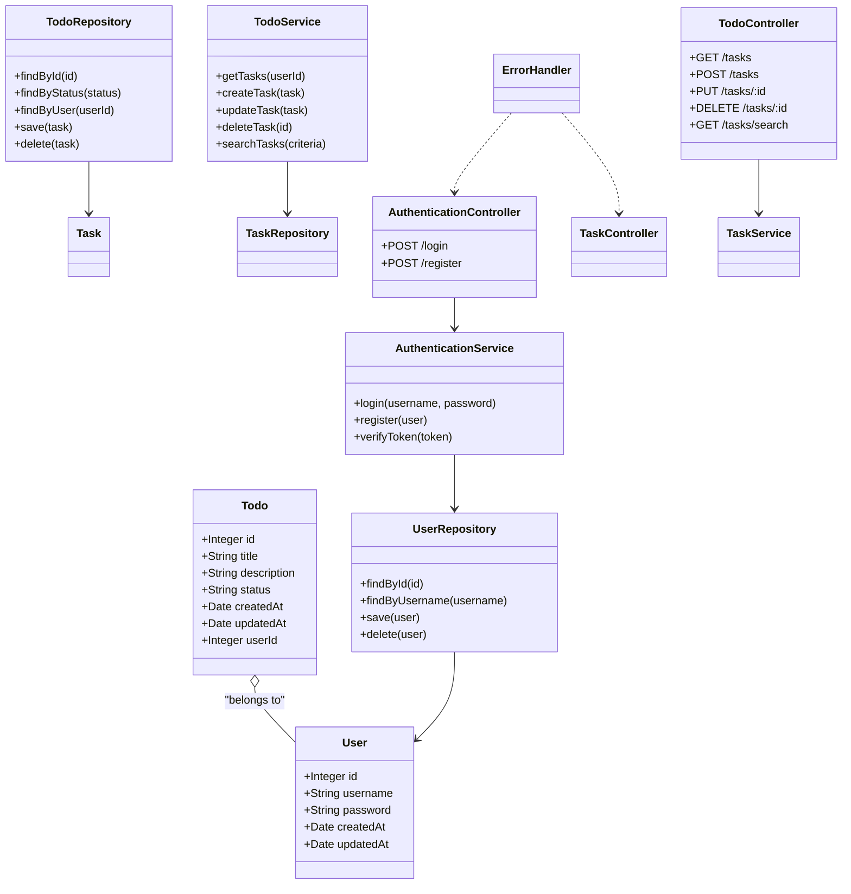

```mermaid
classDiagram
    class User {
        +Integer id
        +String username
        +String password
        +Date createdAt
        +Date updatedAt
    }

    class Todo {
        +Integer id
        +String title
        +String description
        +String status
        +Date createdAt
        +Date updatedAt
        +Integer userId
    }

    class UserRepository {
        +findById(id)
        +findByUsername(username)
        +save(user)
        +delete(user)
    }

    class TodoRepository {
        +findById(id)
        +findByStatus(status)
        +findByUser(userId)
        +save(task)
        +delete(task)
    }

    class AuthenticationService {
        +login(username, password)
        +register(user)
        +verifyToken(token)
    }

    class TodoService {
        +getTasks(userId)
        +createTask(task)
        +updateTask(task)
        +deleteTask(id)
        +searchTasks(criteria)
    }

    class AuthenticationController {
        +POST /login
        +POST /register
    }

    class TodoController {
        +GET /tasks
        +POST /tasks
        +PUT /tasks/:id
        +DELETE /tasks/:id
        +GET /tasks/search
    }


    UserRepository --> User
    TodoRepository --> Task

    AuthenticationService --> UserRepository
    TodoService --> TaskRepository

    AuthenticationController --> AuthenticationService
    TodoController --> TaskService

    Todo o-- User : "belongs to"

    ErrorHandler ..> AuthenticationController
    ErrorHandler ..> TaskController
```
